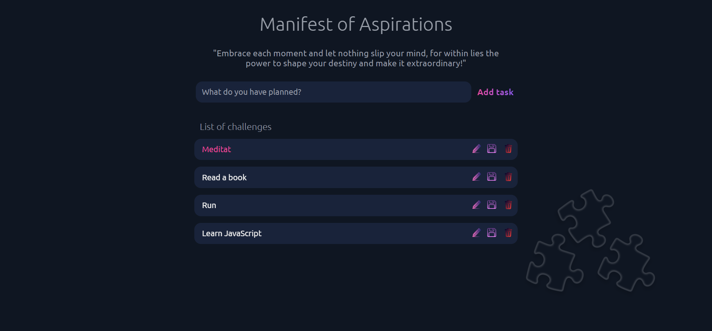
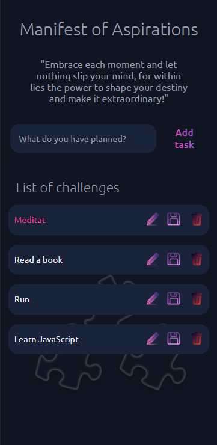

# To do list

> Project "To-Do List" is a simple application to manage your to-do list. The
> main goal of the project is to allow the user to add, edit and delete

## Table of contents

- [General info](#general-info)
- [Screenshots](#screenshots)
- [Technologies](#technologies)
- [Setup](#setup)
- [Features](#features)
- [Status](#status)

## General info

> The objective of the project is to practice separation of concern in
> JavaScript.

## Screenshots





## Technologies

- JavaScript
- HTML5
- CSS3
- VSC code

## Setup

clone the repo and start using To do list.

## Code Examples

```js
const taskInputElement = document.createElement('input');
taskInputElement.classList.add('text');
taskInputElement.type = 'text';
taskInputElement.value = taskData.value;
taskInputElement.setAttribute('readonly', 'readonly');
```

## Features

The project is under development. Currently, the basic functions of adding,
deleting and editing tasks are being developed. Then, the functions of marking
tasks as done and filtering tasks will be added. Once all features are completed
and tested, the project will be ready for deployment.

## Status

Project is: _done_
